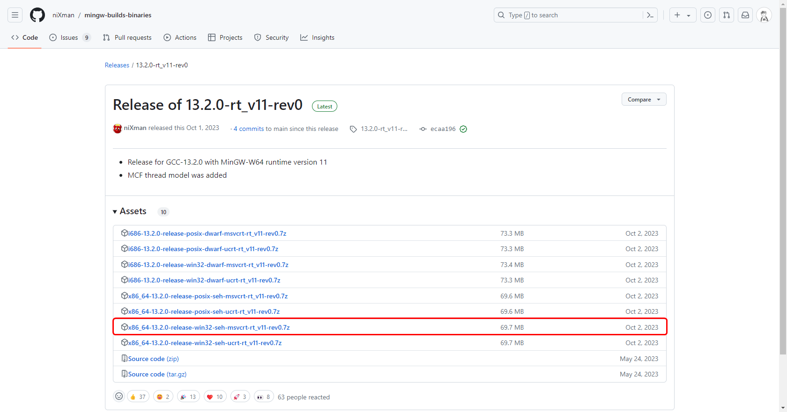
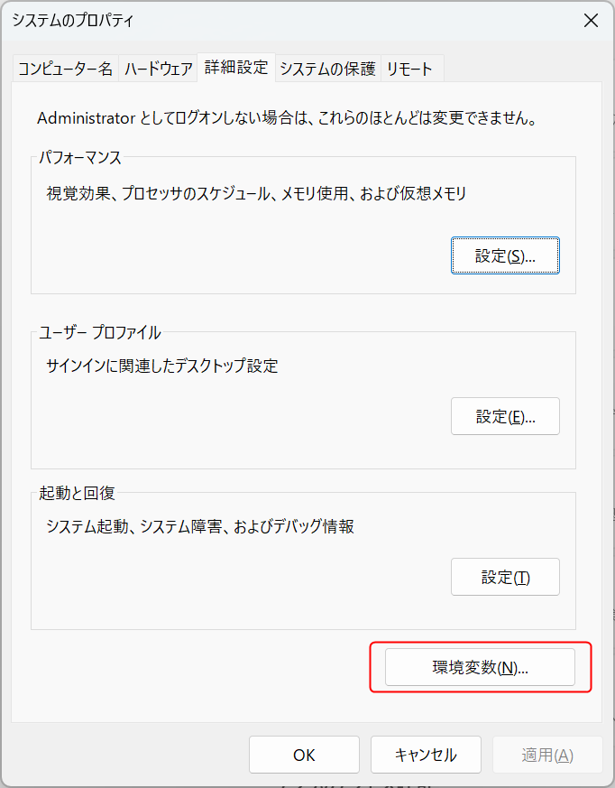

# 環境

WindowsにC/C++環境を導入します。

# 方法の違い

このページでは3種類の方法を紹介しています。

* 方法1:Visual Studioをインストールする
* 方法2:MinGWでGCCを導入する
* 方法3:CygwinでGCCを導入する

|  | 方法1 | 方法2 | 方法3 |
|---|---|---|---|
| インストールするもの | Visual Studio | MinGW | Cygwin |
| C/C++対応 | C++のみ | C/C++ | C/C++ |
| コンパイラ | Visual C | GCC/Clang | GCC/Clang |
| 有償無償 | 学生のみ無償 | 無償 | 無償 |
| サイズ | 大きい | 小さい | ほどほど |
| POSIX | 準拠しない | 微妙 | POSIX準拠 |
| コンパイルしたものの速度 | 高速 | 高速 | やや低速 |
| 使用するエディタ | Visual Studio | VSCodeなど | VSCodeなど |
| プロジェクト(sln) | VS準拠 | 特になし | 特になし |
| インストールの複雑度 | 比較的簡単 | 普通 | 難しい |

T学科とP学科では、方法1が学科指定で行われることを確認しています。

推奨としては、方法2及び方法3を推奨しています。

MinGWとCygwinの違いは、MinGWはGCCをWindowsで動作させる最低限の機能を有しているのに対して、CygwinはUnix環境で用いられるPOSIXというコマンドライン環境を丸ごとWindowsに移植させたものになっています。前者のほうが、簡単にインストール出来ますし、

# 操作前の注意

Windowsでは、OneDriveによる問題を回避するため、OneDriveをなるべく無効化してください。

特に、方法2と方法3では、「ドキュメント」フォルダが`C:¥Users¥{ユーザー名}¥Documents`になっていることを確認して下さい。

確認方法は「ドキュメント」を右クリックして、プロパティを開き、「場所」タブから確認できます。

# 方法1 Visual Studioを使用する（C++のみ）

## 1. Visual Studio Installerのインストール

まず、[Microsoftのページ](https://visualstudio.microsoft.com/ja/)からVisual Studio Installerをインストールします。

ダウンロードしたら、ダウンロードフォルダに「VisualStudioSetup」というものが現れるので、それをダブルクリックで開きます。なおこのとき、ユーザーアカウント制御が表示されるので、「はい」を選択します。

## 2. Visual Studioのインストール

Visual Stduio Installerをインストールしたら、「使用可能」タブから「Visual Studio Community」をインストールします。

すると「インストール中」というウィンドウが登場するので、少なくとも「C++によるデスクトップ開発」を選択した上で「インストール」を選択します。

サインインと出たら、今はスキップするを選択して下さい。

## 3. 使用方法

Visual Studioを初めて起動すると、サインインが求められますが、サインインしてもしなくても大丈夫です。その次に、テーマを選べるので、お好みで選んで下さい。

そうしたら、Visual Studioが起動します。

### 3-1. プロジェクトの作成

「開始する」などが書かれたウィンドウが開いたら、新シプロジェクトの作成をクリックします。

そして「新しいプロジェクトテンプレート」の「コンソールアプリ」というテンプレートをクリックします。

プロジェクト名とソリューション名をきめます。プロジェクト名を編集すると勝手にソリューション名も編集されますが、ソリューション名を変更すると個別に変更することが可能です。

作成を押します。

### 3-2. 実行

プロジェクトが作成されると、`プロジェクト名.cpp`というファイルが生成され、エディタが表示されます。ここで、試験的にそのまま「ローカルWindowsデバッガー」をクリックします。F5でも可能です。

すると、黒いウィンドウが表示されて「Hello World!」と表示されます。

```c++
#include<iostream>

int main(){
    std::cout << "Hello World!";
    return 0;
}
```

### 3-3. オプション C を動かす

Cは基本的に動きませんが、C++上で擬似的に動かすことが可能です。しかし、`scanf`が使用出来ませんので注意して下さい。

# 方法2.MinGW

## 1. MinGW-w64をダウンロードする

MinGW-w64を[このページ](https://github.com/niXman/mingw-builds-binaries/releases)からダウンロードします。latestというマークがついたものが安定版なのでこれをインストールしてください。

Assetsの中の「x86_64-xx.x.x-release-win32-seh-msvcrt-rt_v11-rev0.7z」をダウンロードしてください。



## 2. MinGW-w64を展開してProgram Filesに移動する

「ダウンロード」フォルダに、ダウンロードされたファイルを右クリックして「すべて展開」を押します。そして、実行まで押すと、とりあえず「mingw64」というフォルダが入ったディレクトリが新規生成されます。

「mingw64」フォルダを`C:\Program Files`に移動させます。

## 3. 環境変数を編集する

設定アプリを開き、検索欄に「システム環境変数」と入力し、「システム環境変数の編集」を開きます。

そして「環境変数」を押します。



環境変数というウィンドウが出てきたら、システム環境変数の「PATH」をクリックして、「編集」を押します。

そして「環境変数名の編集」というウィンドウが出てきたら「新規」を押して`C:\Program Files\minggw64\bin`と入力します。

## 4. 動作確認

コマンドプロンプトあるいはWindowsターミナルを開き、`gcc --version`と入力し、以下の表記に似たものが出てくれば動作しています。

```
Copyright (C) 2022 Free Software Foundation, Inc.
This is free software; see the source for copying conditions.  There is NO
warranty; not even for MERCHANTABILITY or FITNESS FOR A PARTICULAR PURPOSE.
```

# 方法3.Cygwinを使用する

## 1. Cygwinのインストーラをダウンロードする

[Cygwinのサイト](https://www.cygwin.com/)から、Cygwinをダウンロードします。画面中腹辺りの「Installing Cygwin」の「setup-x86_64.exe」をクリックします。

## 2. Cygwinをインストールする

ダウンロードしたものを開き、しばらく「次へ」を押し続け「Choose A Download Site」にたどり着いてください。

その画面で「Available Download Site」から適当にURLを選んで下さい。なんとなく、国内の方がダウンロードが早いと思うので、山形大学が提供している`https://ftp.yz.yamagata-u.ac.jp`を選ぶと良いかもしれません。

次へを押すと、大きな画面で「Cygwin Setup - Select Packages」から「All」の左の展開してDevelの中から「gcc-core」と「gcc-g++」を探し、その行の「Skip」をクリックして「11.4.0-1」などという数字にします。

また、次へを押し続け、最後「完了」を押すと終了します。

## 3. 環境変数を編集する

設定アプリを開き、検索欄に「システム環境変数」と入力し、「システム環境変数の編集」を開きます。

そして「環境変数」を押します。


環境変数というウィンドウが出てきたら、システム環境変数の「PATH」をクリックして、「編集」を押します。

そして「環境変数名の編集」というウィンドウが出てきたら「新規」を押して`C:\cygwin64\bin`と入力します。

## 4. 動作確認

コマンドプロンプトあるいはWindowsターミナルを開き、`gcc --version`と入力し、以下の表記に似たものが出てくれば動作しています。

```
Copyright (C) 2022 Free Software Foundation, Inc.
This is free software; see the source for copying conditions.  There is NO
warranty; not even for MERCHANTABILITY or FITNESS FOR A PARTICULAR PURPOSE.
```